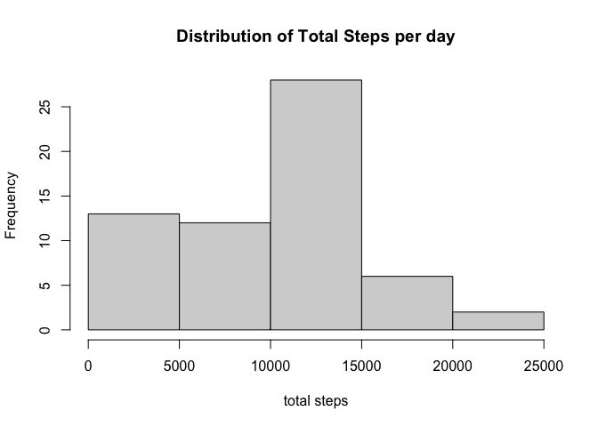
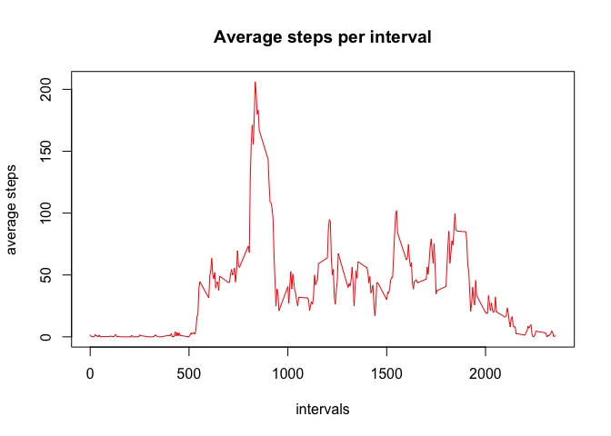
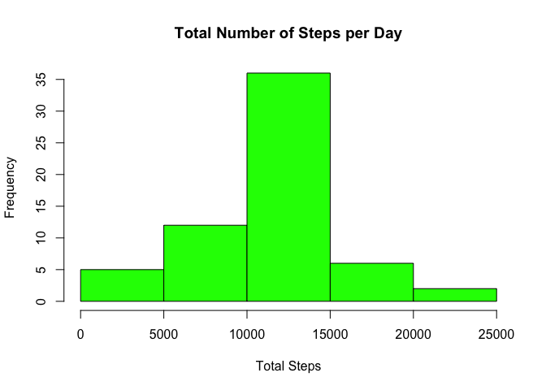
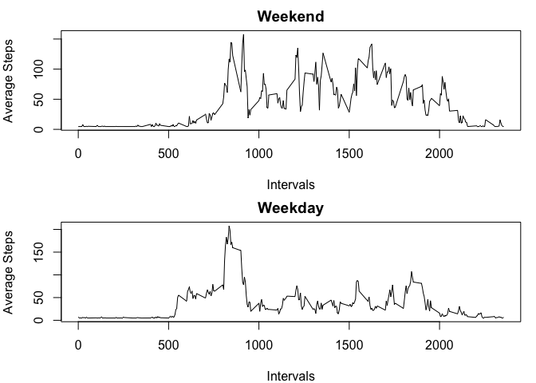

## Loading and preprocessing the data

Following code-block would unzip any zip file in name of activity.zip & assign it to the variable named "activity", however conditional unziping functions were not applied as overwriting existing Zip fule may have no impact on the overall dataset.


```r
unzip("./activity.zip")
activity<-read.csv("./activity.csv")
```

Following code were intended to explore basics of the dataset "activity"

1. view dimensions 

```r
dim(activity)
```

```
## [1] 17568     3
```
2. view the structure

```r
str(activity)
```

```
## 'data.frame':	17568 obs. of  3 variables:
##  $ steps   : int  NA NA NA NA NA NA NA NA NA NA ...
##  $ date    : chr  "2012-10-01" "2012-10-01" "2012-10-01" "2012-10-01" ...
##  $ interval: int  0 5 10 15 20 25 30 35 40 45 ...
```
here we noticed that data is set to chr. therefore, its better to change it to data

```r
activity$date<-as.Date(activity$date)
```
3. view headers

```r
names(activity)
```

```
## [1] "steps"    "date"     "interval"
```
4. view the first set of rows

```r
head(activity)
```

```
##   steps       date interval
## 1    NA 2012-10-01        0
## 2    NA 2012-10-01        5
## 3    NA 2012-10-01       10
## 4    NA 2012-10-01       15
## 5    NA 2012-10-01       20
## 6    NA 2012-10-01       25
```
5. view the last set of rows

```r
tail(activity)
```

```
##       steps       date interval
## 17563    NA 2012-11-30     2330
## 17564    NA 2012-11-30     2335
## 17565    NA 2012-11-30     2340
## 17566    NA 2012-11-30     2345
## 17567    NA 2012-11-30     2350
## 17568    NA 2012-11-30     2355
```
6. Nnumber of NA's

```r
sum(is.na(activity))
```

```
## [1] 2304
```

## What is mean total number of steps taken per day?

its better to exploratory analysis of steps parameter via histogram in oder to calculate total number of steps taken per day

```r
totalsteps_date<-with(activity, tapply(steps,date,sum,na.rm=TRUE))
stepsmean<-mean(totalsteps_date)
hist(totalsteps_date, main = "Distribution of Total Steps per day", xlab = "total steps")
```

<!-- -->
its 3 point summary can be displayed as bellow

```r
summary(totalsteps_date)
```

```
##    Min. 1st Qu.  Median    Mean 3rd Qu.    Max. 
##       0    6778   10395    9354   12811   21194
```
considering above displayed information the mean total number of steps taken per day = **9354.2295082**

## What is the average daily activity pattern?

this may refers to average amount of steps taken per interval accross all days. in order to do that following code is applied

```r
averagesteps<-with(activity,tapply(steps,interval,mean,na.rm=TRUE)) #tapply to apply means to steps column combined with interval column removing NAs
intervals<-unique(activity$interval) #unique intervals are created by removing NAs
#since both lengths are equal it can plotted as below
plot(intervals,averagesteps,type = "l", ylab="average steps", main="Average steps per interval", col="red")
```

<!-- -->

## Imputing missing values

First we have to see the number of NAs in the steps column of activity data set

```r
na_no<-sum(is.na(activity$steps))
```
There are **2304** observations with NA in the steps column of activity data set

in this case we shall create a histogram by filling missing data

```r
index<-which(is.na(activity$steps))
l<-length(index)
steps_avg<-with(activity,tapply(steps,date,mean,na.rm=TRUE))
na<-mean(steps_avg,na.rm = TRUE)
for (i in 1:l) {
        activity[index[i],1]<-na
}
steps2avg<-with(activity,tapply(steps,date,sum,na.rm=TRUE))
hist(steps2avg,col = "green",xlab = "Total Steps",ylab = "Frequency",main = "Total Number of Steps per Day")
```

<!-- -->


## Are there differences in activity patterns between weekdays and weekends?

for this we would need functions frop dplyr package

```r
library(dplyr)
```

```
## 
## Attaching package: 'dplyr'
```

```
## The following objects are masked from 'package:stats':
## 
##     filter, lag
```

```
## The following objects are masked from 'package:base':
## 
##     intersect, setdiff, setequal, union
```
a new variable named "day" is created to indicate wether each entry is a weekday or a week end as follows

```r
activity_mod<- mutate(activity, day = ifelse(weekdays(activity$date) == "Saturday" | weekdays(activity$date) == "Sunday", "weekend", "weekday"))
activity_mod$day<-as.factor(activity_mod$day)
```
using this modified data set "activity_mod" we could generate plots of average steps activity during weekends vs week days as below

```r
act_wknd<-subset(activity_mod,as.character(activity_mod$day)=="weekend")
act_wkdy<-subset(activity_mod,as.character(activity_mod$day)=="weekday")
steps_wknd<-with(act_wknd,tapply(steps,interval,mean,na.rm=TRUE))
steps_wkdy<-with(act_wkdy,tapply(steps,interval,mean,na.rm=TRUE))
int_wknd<-unique(act_wknd$interval)
int_wkdy<-unique(act_wkdy$interval)
new_wknd<-data.frame(cbind(steps_wknd,int_wknd))
new_wkdy<-data.frame(cbind(steps_wkdy,int_wkdy))
par(mfrow=c(2,1),mar=c(4,4,2,1))
plot(new_wknd$int_wknd,new_wknd$steps_wknd,type = "l",xlab = "Intervals",
     ylab = "Average Steps",main = "Weekend")
plot(new_wkdy$int_wkdy,new_wkdy$steps_wkdy,type = "l",xlab = "Intervals",
     ylab = "Average Steps",main = "Weekday")
```

<!-- -->

after analysing the pattern we could see that there is an average of **35.6105812** steps per day during weekdays and an average of **42.3664013** steps per day during weekdays. 

in conclusion we can say that higher activity during weekends more than weekend is **TRUE**
